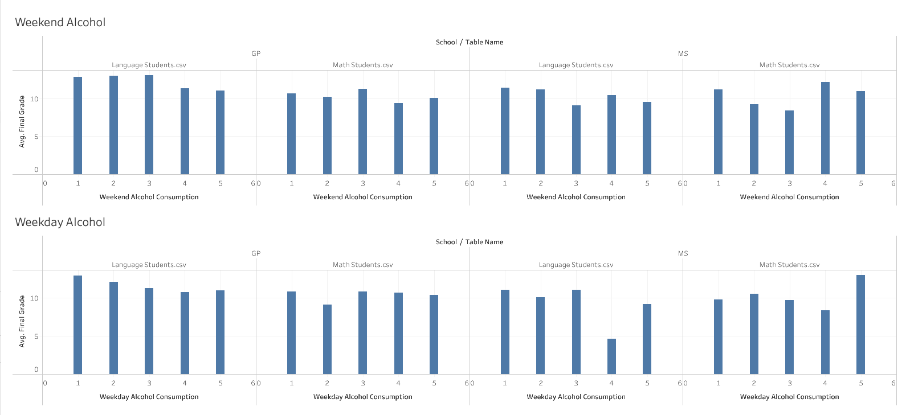
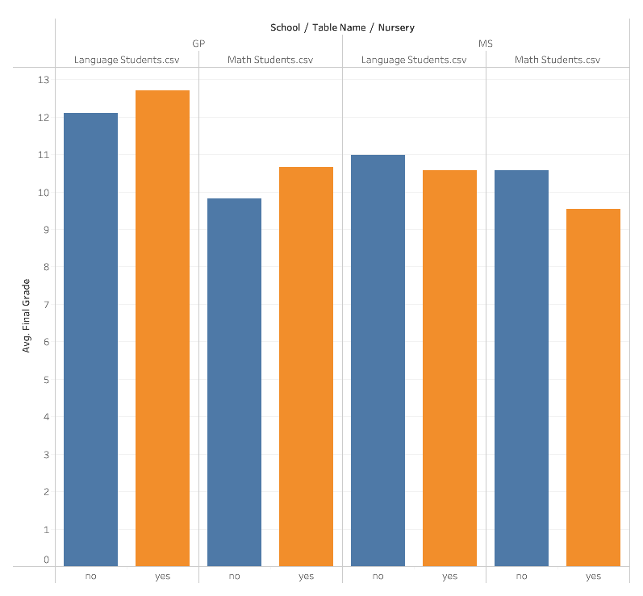
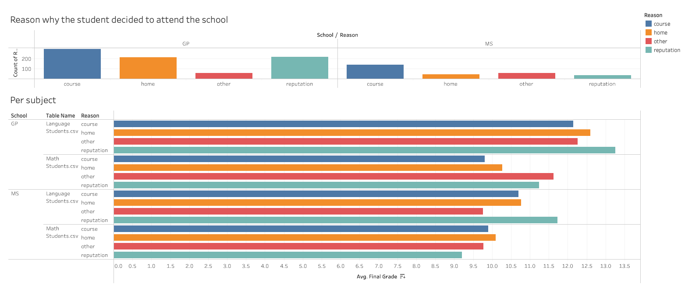
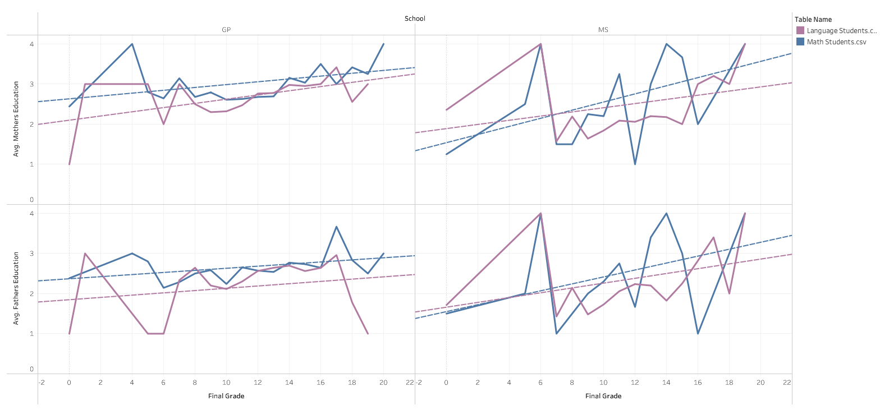
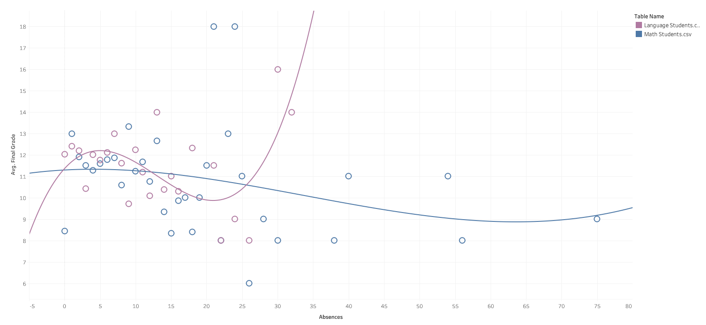
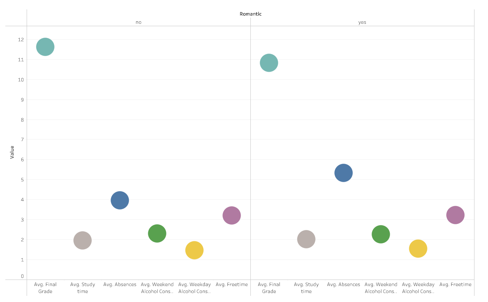
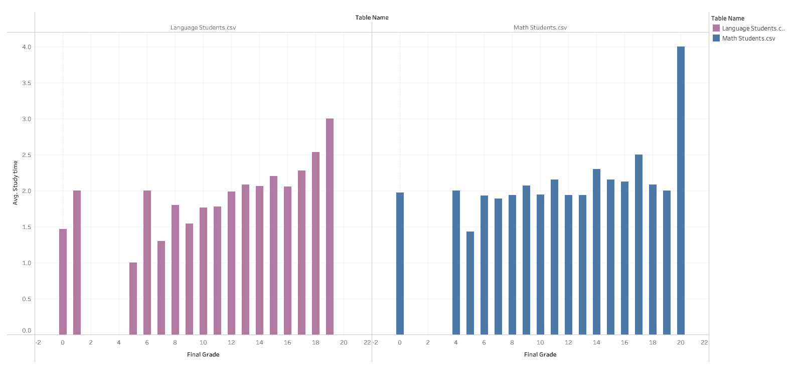

# Project3-Students

For this project, we chose to run a regression analysis on a dataset containing secondary school data from Portugal. Once we found the factors the most influenced final grades, we drilled down on those factors in Tableau. We also attempted to create a Tableau web data connector (WDC) by loading the data through a mongoDB database to a Flask app and then through a WDC url.

### The Data

For this project, we chose a data set from Kaggle containing demographic data and scores for secondary school students in Portugal, which can be found here: https://www.kaggle.com/impapan/student-performance-data-set. The data comes from two schools and is divided into math and Portuguese (note: 'language' or 'reading' is used interchangeably with Portuguese in our analysis). The factor columns are listed below with a short description for each:

1. school - student's school (binary: 'GP' - Gabriel Pereira or 'MS' - Mousinho da Silveira)
2. sex - student's sex (binary: 'F' - female or 'M' - male)
3. age - student's age (numeric: from 15 to 22)
4. address - student's home address type (binary: 'U' - urban or 'R' - rural)
5. famsize - family size (binary: 'LE3' - less or equal to 3 or 'GT3' - greater than 3)
6. Pstatus - parent's cohabitation status (binary: 'T' - living together or 'A' - apart)
7. Medu - mother's education (numeric: 0 - none, 1 - primary education (4th grade), 2 – 5th to 9th grade, 3 – secondary education or 4 – higher education)
8. Fedu - father's education (numeric: 0 - none, 1 - primary education (4th grade), 2 – 5th to 9th grade, 3 – secondary education or 4 – higher education)
9. Mjob - mother's job (nominal: 'teacher', 'health' care related, civil 'services' (e.g. administrative or police), 'at_home' or 'other')
10. Fjob - father's job (nominal: 'teacher', 'health' care related, civil 'services' (e.g. administrative or police), 'at_home' or 'other')
11. reason - reason to choose this school (nominal: close to 'home', school 'reputation', 'course' preference or 'other')
12. guardian - student's guardian (nominal: 'mother', 'father' or 'other')
13. traveltime - home to school travel time (numeric: 1 - <15 min., 2 - 15 to 30 min., 3 - 30 min. to 1 hour, or 4 - >1 hour)
14. studytime - weekly study time (numeric: 1 - <2 hours, 2 - 2 to 5 hours, 3 - 5 to 10 hours, or 4 - >10 hours)
15. failures - number of past class failures (numeric: n if 1<=n<3, else 4)
16. schoolsup - extra educational support (binary: yes or no)
17. famsup - family educational support (binary: yes or no)
18. paid - extra paid classes within the course subject (Math or Portuguese) (binary: yes or no)
19. activities - extra-curricular activities (binary: yes or no)
20. nursery - attended nursery school (binary: yes or no)
21. higher - wants to take higher education (binary: yes or no)
22. internet - Internet access at home (binary: yes or no)
23. romantic - with a romantic relationship (binary: yes or no)
24. famrel - quality of family relationships (numeric: from 1 - very bad to 5 - excellent)
25. freetime - free time after school (numeric: from 1 - very low to 5 - very high)
26. goout - going out with friends (numeric: from 1 - very low to 5 - very high)
27. Dalc - workday alcohol consumption (numeric: from 1 - very low to 5 - very high)
28. Walc - weekend alcohol consumption (numeric: from 1 - very low to 5 - very high)
29. health - current health status (numeric: from 1 - very bad to 5 - very good)
30. absences - number of school absences (numeric: from 0 to 93)
31. G1 - first period grade (numeric: from 0 to 20)
32. G2 - second period grade (numeric: from 0 to 20)
33.  G3 - final grade (numeric: from 0 to 20, output target)

It is worth noting here that there are some cultural and social differences from the American education system in this data. For one, the drinking age in Portugal is 18, so alcohol consumption and relatively commonplace. Additionally, students are not limited by geographic district like in the US. The 'reason' category indicates which factors went into the students' and parents' decision-making when enrolling in a particular school.

### Machine Learning (Regression Analysis)

The machine learning part of this project was two linear regressions (one for each subject) to find the most important factors influencing final test scores (G3). The regression created an equation with weighted coefficients for each factor, which were used to find relative weight of each in determining the final score. The reading regression can be found here: https://colab.research.google.com/drive/1hEBb9s6MEb7VH6WrPW3bSTyEFOt92SVH?usp=sharing and the math regression can be found here: https://colab.research.google.com/drive/1RWOVCz39bCL1MGd-EfV7sFCfLfUUMuEL?usp=sharing.

Note: Because the final number is small (0-20) and there are so many factors, each coefficient is incredibly small. The value of the coefficient value is less important than its position relative to others and whether the value is positive or negative. 

After reading in the data, we used dummy encoding to split up the string type columns into numeric types. From there, we used train_test_split() and a Standard Scaler. 

Once the data was split and processed, we ran the data through four different regression models: LinearRegression, Lasso, Ridge, and ElasticNet. In both math and reading, the Lasso model yeilded the lowest mean-squared error and the greatest r2. 

For each subject, we isolated the 5 most positive and 5 most negative coefficients for futher analysis. We left out G1 and G2 as these were obvously going to be the most predictive factors. The results were:

**Positive Impact on Math Scores**
1. Absences
2. Family Relationship Quality
3. Weekend Alcohol Consumption
4. Reason - Reputation
5. No Extra Curricular Activities

**Negative Impact on Math Scores**
1. Age
2. School - GP
3. Guardian - Other
4. Reason - Close to Home
5. No Extra Educational Support

**Positive Impact on Reading Scores**
1. Travel Time
2. Absences
3. Being Female
4. Guardian - Other
5. Father's Job - At Home

**Negative Impact on Reading Scores**
1. Previous Class Failures
2. Reason - Other
3. Free Time
4. Weekend Alcohol Consumption
5. Mother's Job - Other

These factors and others were explored further in Tableau

### Tableau WDC

Before exploring the data in Tableau, we attempted to create a Web Data Connector to load in the data. 

First, this required loading the data into a database to be delpoyed in a Flask App. We used a Jupyter Notebook to load each row as a MongDB collection in MongoCloud. The Flask app contained two routes (one for language, on for math) and was deployed to Heroku.

After the data was available in JSON format in the deployed app, we built connctors in HTML/JavaScript, one url for language and one for math. Most of this code was pre-written and can be found here: https://tableau.github.io/webdataconnector/docs/wdc_tutorial.html. Our team changed the column names and value types so it could be loaded into Tableau.

To load this data, run reading_wdc.html or math_wdc.html in your preferred live server. These files can be found in the wdc branch of this repository. In Tableau, choose Web Data Connector as your pload method. Then paste the live url into the box and click enter. When the page comes up in the small window, click the "Get Data" button. Tableau will load the blank columns first, then click Update to load in the data. 

### Tableau Drill Down

From the Machine Learning phase, we identified several areas for futher exploration in no particular order: 

* Alcohol Consumption
* Nursery School
* Reason
* Parents' Education
* Absences
* Relationship Status
* Study Time

The following trends were found in relation to those factors:

### Alcohol Consumption

Alcohol consumption, interestingly had no clear effect on overall grades. For each school and each subject, scores varied seemingly independent of alcohol consumption. In some cases, moderate-to-heavy consumption on the weekdays had a negative impact, like at MS in language scores. But also at the same school there were high performers in math that drank as much or more. 

One thing to note is that, in terms of raw numbers, far fewer students drank than not. But again, there seemed to be no discrnable impact on scores overall.

### Nursery School

For students attending GP, attending nursery school as children did have some postive impact on final test scores. Interestingly, this was not the case for MS students. More research would be needed to determine of this is simply a coincidence or if there is some explanation, possibly the quality of nusery schools in one region versus another. 

### Reason

Students at GP were much more likely to cite reputation as the reason for attending this particular secondary school. This seems to have had a particular impact on language students, though at both schools students scored highest on language tests if the reason for choosing that school was its reputation. In math for both school, performance was generally much lower than language, and also students' performance in relation to their reasons for choosing that school were more mixed. This may suggest that both swchools have a better reputation for their language courses than their math courses. 

### Parents' Education

Based on the trend lines, there is a slight increase in test scores among students' whos parents have a higher education. This trend is more pronounced at MS than GP, and in all cases parents' education helps more in math than in language classes. 

### Absences

Absences was a metric that was somewhat counterintuitive. For math students, more absences generally lead to lower grades, though not in all cases (see the outliers that missed 20+ classes, yet attained the highest scores, but also a student who missed about the same amount but scores the lowest). For language students, the picture was more mixed, with low-absence students performing at the middle of the pack, moderate-absence students performing lower, but then the highest-absence students performing best. One thing that is not clear is the reason for these absences. It potentially could make a big difference if students were taking days off to sleep in versus taking days off to attend a academic conference, for example. 

### Relationship Status

Being in a relationship did have a moderately detrimental impact on average scores and slightly increased absence rates. Other metrics were relatively unaffected. More research would need to be conducted to determine of these factors  are correlated in any meaningful way or if they are just anomolous to this dataset.

### Study Time

Study time did have some impact on final grades, with studey time generally coinciding with better scores, especially on the high end. This relationship seems relatively clear in language students, but less so in math studetns. In math, study times were realtively cvonstant across scores, suggesting little impact except in the most extreme end where students devoted 10 or more hours a week to studying. That sain, in both subjects, the students who studied the most got the best grades. 

